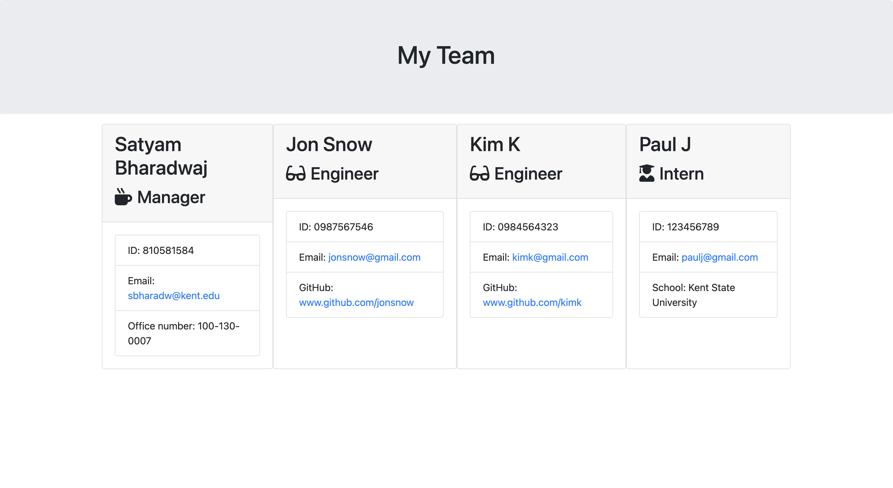
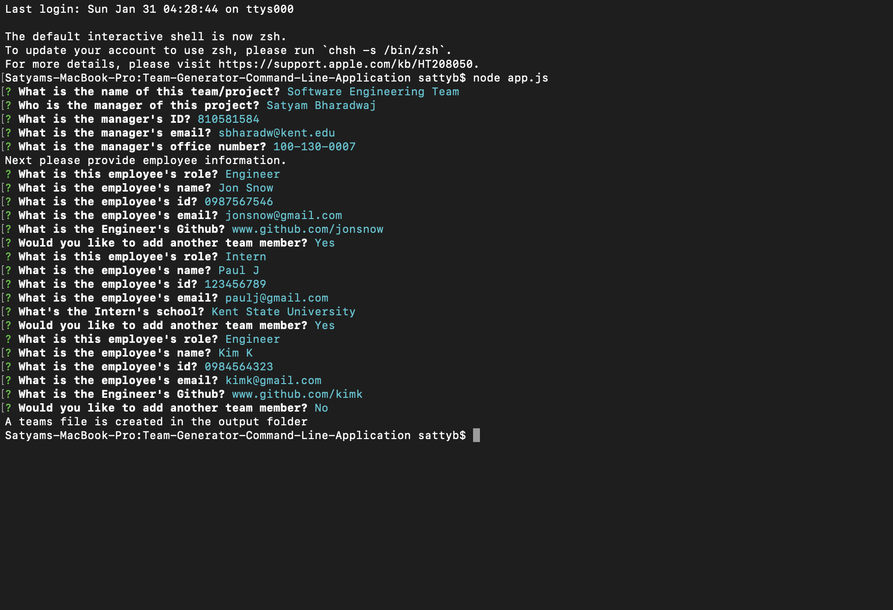

# Team-Generator-Command-Line-Application

```
As a manager
I want to generate a webpage that displays my team's basic info
so that I have quick access to emails and GitHub profiles
```
------------------------------------------------------------------------
------------------------------------------------------------------------

* [Inquirer npm package](https://github.com/SBoudrias/Inquirer.js/) to prompt the user for their email, id, and specific information based on their role with the company. For instance, an intern may provide their school, whereas an engineer may provide their GitHub username.

* The devDependencies is [jest](https://jestjs.io/) for running the provided tests.

* This app runs as a Node CLI to gather information about each employee.

* Make sure to `npm install`.




